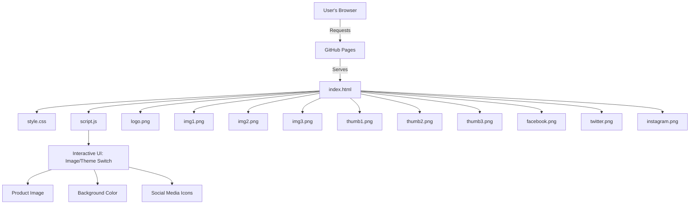

# ☕ Starbucks Landing Page

A visually rich, responsive Starbucks landing page built using HTML, CSS, and JavaScript. This project showcases modern web design techniques, interactive product previews, and smooth user experience—all without any frameworks or build tools.

[**🌐 Live Demo → sinha-19.github.io/Starbucks/**](https://sinha-19.github.io/Starbucks/)

---

## 🗺️ Workflow Diagram



---

## 📁 Project Structure

```
Starbucks/
├── index.html           # Main HTML file for the landing page
├── style.css            # All styles for layout, colors, animations, responsiveness
├── script.js            # Handles interactivity (image and theme switching)
├── logo.png             # Starbucks logo
├── img1.png             # Main product image 1
├── img2.png             # Main product image 2
├── img3.png             # Main product image 3
├── thumb1.png           # Thumbnail image 1
├── thumb2.png           # Thumbnail image 2
├── thumb3.png           # Thumbnail image 3
├── facebook.png         # Facebook icon
├── twitter.png          # Twitter icon
├── instagram.png        # Instagram icon
```

---

## ✨ Features

- **Fully Responsive Design:** Looks great on desktop, tablet, and mobile screens.
- **Animated Product Preview:** Click any thumbnail to instantly update the featured product and background color.
- **Modern UI Elements:** Rounded cards, drop-shadows, vibrant color palette, and smooth transitions.
- **Social Media Integration:** Clickable Facebook, Twitter, and Instagram icons.
- **Accessible:** Uses semantic HTML and descriptive alt tags for images.
- **No Frameworks:** Pure HTML, CSS, and vanilla JavaScript—easy to understand and customize.
- **Lightweight:** Fast loading, minimal dependencies, and optimized for GitHub Pages hosting.

---

## 📝 How It Works

- **index.html**  
  - The main structure for the landing page, including hero section, product details, thumbnails, and social icons.
- **style.css**  
  - Handles all styling, including layout, colors, responsive breakpoints, hover effects, and transitions.
- **script.js**  
  - Listens for clicks on product thumbnails.
  - Dynamically updates the main product image and background color to match the selected flavor.
  - Ensures a smooth, interactive user experience.

---

## 🌐 Live Demo

> **Try it now:**  
> [https://sinha-19.github.io/Starbucks/](https://sinha-19.github.io/Starbucks/)

---

## 🖼️ Assets Overview

| File           | Description                    |
|----------------|-------------------------------|
| logo.png       | Starbucks logo in header       |
| img1.png       | Main drink/product image 1     |
| img2.png       | Main drink/product image 2     |
| img3.png       | Main drink/product image 3     |
| thumb1.png     | Thumbnail image 1              |
| thumb2.png     | Thumbnail image 2              |
| thumb3.png     | Thumbnail image 3              |
| facebook.png   | Facebook icon in footer        |
| twitter.png    | Twitter icon in footer         |
| instagram.png  | Instagram icon in footer       |

---

## 🚀 Getting Started (Local Development)

1. **Clone the repository:**
   ```bash
   git clone https://github.com/sinha-19/Starbucks.git
   cd Starbucks
   ```

2. **Open `index.html` in your browser:**
   - Double-click the file  
     **OR**
   - Run a simple local server:
     ```bash
     npx serve .
     # or use Python
     python -m http.server
     ```

3. **Customize:**  
   - Replace images or modify text/styles as needed in `img*.png`, `logo.png`, and `style.css`.

---

## 🛠️ Customization Tips

- **Change Product Images:**  
  Replace `img1.png`, `img2.png`, `img3.png` and their corresponding thumbnails.
- **Update Social Links:**  
  Edit the `<a>` tags in `index.html` to link to your own profiles.
- **Modify Theme Colors:**  
  Adjust `.main-bg` or other background classes in `style.css`.
- **Add More Products:**  
  Duplicate a thumbnail/product block in `index.html` and update `script.js` logic to support more images/colors.

---

## 💡 Credits

- **Design Inspiration:** Based on Starbucks’ official style.
- **All images/icons:** For demo purposes only (use your own for production).
- **Developed by:** [Saket Kumar Sinha](https://github.com/sinha-19)

---

## 📝 License

This project is open-source and free to use for learning or portfolio purposes.  
_Starbucks trademarks and logos belong to Starbucks Corporation._

---

> _Beautiful, interactive landing page for Starbucks—built with pure web technologies!_
